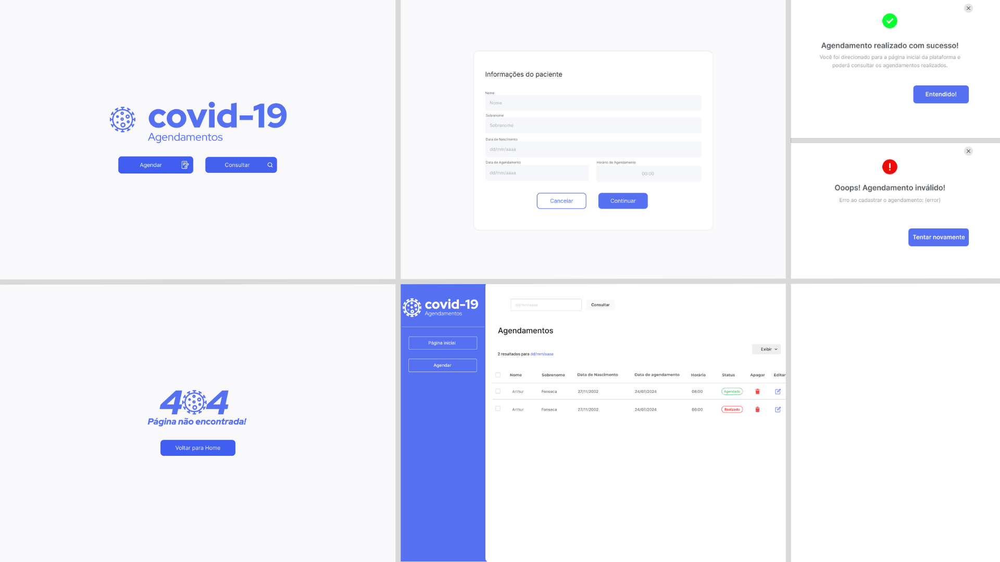

<h1 align="center">
  Covid19 Agendamentos Frontend
</h1>

<p align="center">
<a href="#desktop_computer-sistema">Sistema</a>&nbsp;&nbsp;&nbsp;|&nbsp;&nbsp;&nbsp;
  <a href="#memo-requisitos">Requisitos</a>&nbsp;&nbsp;&nbsp;|&nbsp;&nbsp;&nbsp;
  <a href="#rocket-tecnologias">Tecnologias</a>&nbsp;&nbsp;&nbsp;|&nbsp;&nbsp;&nbsp;
  <a href="#information_source-como-usar">Como usar</a>&nbsp;&nbsp;&nbsp;|&nbsp;&nbsp;&nbsp;
  <a href="#scroll-scripts-disponíveis">Scripts disponíveis</a>&nbsp;&nbsp;&nbsp;|&nbsp;&nbsp;&nbsp;
  <a href="#earth_americas-rotas-da-api">Rotas da API</a>
</p>


## :desktop_computer: Sistema



## :memo: Requisitos

| Ferramenta| Versão  | Descrição                                    |
|-----------|---------|----------------------------------------------|
| [NodeJS](https://nodejs.org/en/)              | 16.14.0 | Ambiente de execução Javascript server-side  |
| [NPM](https://www.npmjs.com/)                 | 1.22.17 | Gerenciador de pacotes                   |
| [Git](https://git-scm.com/)           | | |


## :rocket: Tecnologias

Este projeto está sendo desenvolvido com as seguintes tecnologias:

-  Linguagem: [Typescript](https://www.typescriptlang.org/);
-  Biblioteca JS para front-end: [ReactJS](https://reactjs.org/);
-  HTTP client: [Axios](https://github.com/axios/axios);
-  Estilização: [Styled-Components](https://www.styled-components.com/) + [React-Icons](https://react-icons.github.io/react-icons/) + [Chakra UI](https://v2.chakra-ui.com/);
-  Rotas: [react-router-dom v6](https://reactrouter.com/docs/en/v6/getting-started/overview);
-  Padronização: [Prettier](https://prettier.io/);

## :information_source: Como usar

É necessário criar o ```.env``` seguindo o padrão das variáveis de ambiente do ```.env.example```

```bash
# Clonar este repositório
$ git clone https://github.com/arthurbfonseca27/covid19-appointments-frontend.git
# Ir para o repositório
$ cd covid19-appointments-frontend
# Instalar as dependências
$ npm install
# Rodar a aplicação em ambiente de desenvolvimento
$ npm start
```
## :scroll: Scripts disponíveis

- `start`: Inicia a aplicação em ambiente de desenvolvimento;
